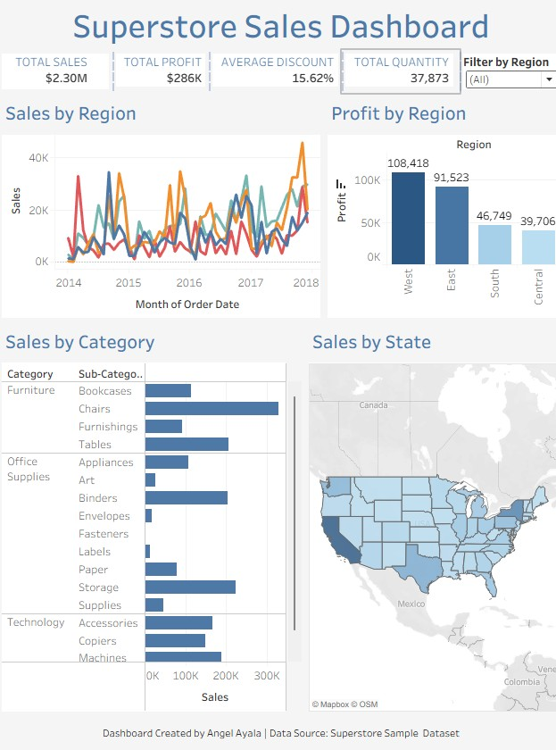

# Superstore Sales Dashboard (Tableau)

**Tools**: Tableau

**Data**: Superstore Sales Dataset (Kaggle)

**Goal**: Create a professional dashobard to visualize KPIs such as sales and profits across regions

## Dashboard Screenshot

## Project Report
The full report can be downloaded here.

[Download Project Report (PDF)](./Superstore%20Sales%20Dashboard%20Report.pdf)

## Dataset Summary
The Superstore dataset contains fictional sales data across the U.S., covering:
- **Order dates, shipping method, region, and state**
- **Sales, profit, quantity, and discount**
- **Product category and sub-category**

## Features of Superstore Sales Dashboard
- KPI cards for Total Sales, Total Profits, Average Discount, Total Quantity
- Monthly Sales trend line chart
- Profit by Region bar chart
- Sales by Category and Sub-Categories
- Sales by State Map (interactive filter by state)
- Region and Sub-Category filter for interactivity

## Questions Investigated
1. What regions are most profitable?  
2. How do monthly sales trends change across regions?  
3. Which sub-categories of products have the most sales?  
4. Are discount levels affecting profit?  
5. What regions are underperforming?

## Key Insights
- **West Region** is the most profitable: $108K profit from $0.73M sales  
- **Central and South** regions underperform in both sales and profit  
- **High discount rate** (24%) in Central region correlates with lower profitability  
- **Top-selling sub-categories**: Phones, Chairs, and Storage  
- **Tables and Bookcases** have high sales but negative profit → pricing strategy should be reviewed

## Recommendations
- Lower discount rate in the Central region to improve margins  
- Boost sales in the South region through targeted campaigns  
- Adjust pricing on underperforming sub-categories (Tables, Bookcases)

